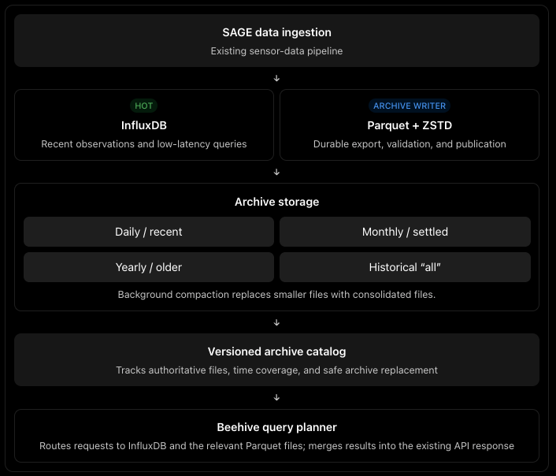

# SAGE Time-Series Storage Design Plan —  InfluxDB 2.0 and and Custom Cold Storage

## 1. Design goal

Build a storage system that keeps recent SAGE observations in InfluxDB, moves older observations into lossless, compressed Parquet, and progressively consolidates older files into a historical archive.

Users continue querying through the existing Beehive Data API. They should not need to know where an observation is stored.

Our updated design has three guiding principles:

1. One authoritative copy per time interval. When a consolidated archive replaces smaller archives, the smaller files are eventually deleted.
2. “All” is a logical historical archive, not one giant file. It remains partitioned so short historical queries do not scan the entire dataset.
3. Keep queryable archives as native Parquet. Use internal ZSTD compression rather than wrapping files in ZIP or GZIP. Cheaper storage classes can be evaluated separately if storage cost becomes the priority.


## 2. Proposed architecture



The diagram shows the logical components. The archive writer and compaction worker can initially be part of the same service, and the catalog can start small.

## 3. Data lifecycle

These windows are initial configuration candidates, not hardcoded assumptions. We should tune them using data volume and query benchmarks.

| Tier              | Example data age     | Physical storage         | Transition                                    |
|-------------------|---------------------|-------------------------|-----------------------------------------------|
| Hot               | Last x days         | InfluxDB                | Export and verify before retention            |
| Recent archive    | 7–30 days           | Native Parquet + ZSTD   | Compact small files as intervals settle       |
| Monthly archive   | 1–12 months         | Native Parquet + ZSTD   | Consolidate eligible files                    |
| Yearly archive    | 1–2 years           | Native Parquet + ZSTD   | Move older coverage into historical archive   |
| Historical “all”  | Older than 2 years  | Native Parquet + ZSTD   | Retain and compact selectively                |

The important detail is that daily, monthly, and yearly describe lifecycle stages, not mandatory file sizes.

A high-volume measurement might need several Parquet files for a single day. A low-volume measurement might not need rewriting every month. Compaction should consider age and file count, file size, and query performance.

### How pruning works

1 Daily files become eligible for consolidation.
v
2 Write and verify replacement files.
v
3 Publish a new catalog version.
v
4 Retire superseded files after active readers finish.

We repeat the same process when monthly coverage moves into yearly storage and when yearly coverage becomes part of historical “all.”

We should never delete a source archive merely because a compaction job finished writing its output. The replacement must be verified and published first.

## 4. Historical “all” archive

I would implement “all” as a logical collection of immutable Parquet files.

For example:

```
archive/
  historical/
    measurement=env.temperature/
      year=2022/
        part-000.parquet
        part-001.parquet
      year=2023/
        part-000.parquet

    measurement=env.humidity/
      year=2022/
        part-000.parquet
```

This is illustrative rather than a finalized partition scheme. We should use actual Beehive query patterns to decide whether measurement, plugin, VSN, or another field deserves a physical partition.

The key distinction is:

Consolidating an archive does not mean combining all its observations into one enormous file.

If someone requests three days of temperature readings from 2022, Beehive should identify the relevant historical files and let the Parquet reader skip unrelated row groups.

Parquet statistics and DuckDB’s partition-filter support make that approach practical.

## 5. Compression and storage cost

Our default should be native Parquet with ZSTD compression across all queryable archive tiers.

| Option                          | Role in this design                                          |
|----------------------------------|-------------------------------------------------------------|
| Parquet + ZSTD                  | Default for queryable archived observations                 |
| Larger, compacted Parquet files  | Reduce small-file and metadata overhead                     |
| ZIP/GZIP wrapping                | Not part of the normal queryable lifecycle                  |
| Cheaper object-storage class     | Optional cost optimization for older data                   |
| Deep archive requiring restoration | Optional future tier, with explicit API behavior            |

External ZIP/GZIP wrapping may save some additional space, but it interferes with selective Parquet reads. Native Parquet compression preserves the file structure that the query engine uses for pruning.


I would not add a deep, restore-required tier in the first implementation. Our current requirement is that historical observations remain queryable. We can revisit deep archival if usage data shows that some very old periods are rarely accessed and the team accepts delayed retrieval.

## 6. Archive catalog

The catalog is the component that makes the lifecycle safe and the routing predictable.

Each published archive entry should identify:

| Field                        | Purpose                                                    |
|------------------------------|------------------------------------------------------------|
| Time interval                | Exact coverage, using `[start, end)` boundaries            |
| Measurement or partition key | Limit the search space                                     |
| File manifest                | Immutable Parquet objects belonging to the archive         |
| Catalog version              | Give queries a consistent view during compaction           |
| Verification status          | Prevent unverified files from becoming authoritative       |
| Superseded files             | Track what can be safely deleted later                     |

A query should pin a catalog version for its duration. A compaction worker can then publish a replacement version without disrupting queries that began before the switch.

This is where Apache Iceberg deserves a focused evaluation. It already provides table snapshots, metadata-based planning, and file-rewrite maintenance. Building our own catalog would mean taking responsibility for those consistency and cleanup behaviors.

For the prototype, we can compare a small custom manifest against an Iceberg-backed dataset before committing to either.

## 7. Beehive query routing

Beehive remains the public interface. The new planner resolves where each portion of a query lives.

```
User query: [2025-06-01, 2026-09-24)
                     |
                     v
             Normalize filters
                     |
                     v
          Resolve time-interval ownership
                     |
          +----------+-----------+
          |                      |
          v                      v
   Archived intervals       Hot interval
          |                      |
          v                      v
   Select Parquet files       InfluxDB
          |                      |
          +----------+-----------+
                     |
                     v
            Merge / aggregate
                     |
                     v
           Existing Beehive response
```

Routing must use the intersection between the requested time range and each storage interval. It should not send an entire multi-year query to one archive simply because its start date is old.

The planner also needs to preserve existing Beehive semantics:

- No gaps or duplicates at tier boundaries.
- Correct global ordering and head/tail behavior.
- Correct aggregation across backends.
- Streaming where possible, rather than loading entire historical results into API memory.

A first version can support bounded raw queries, then expand to aggregations and the rest of the current query behavior.

## 8. Continuous archival and late data

I would distinguish backfilling existing InfluxDB history from archiving newly arriving observations.

For backfill, the existing experimental export-to-Parquet pipeline gives us a starting point. For ongoing archival, we need a durable process with checkpoints and retries.

The writer must account for late observations. If a record arrives for a month that has already been consolidated, we should be able to publish a small correction file or replacement partition without rewriting the entire historical dataset.

InfluxDB retention should only remove an interval after we have confirmed that its observations are durably available through the archive catalog.

## 9. Implementation roadmap

Phase 1, Baseline and data fidelity: Capture representative Beehive queries and export a representative InfluxDB sample. Define a canonical Parquet schema that preserves timestamps, values, and metadata without silently dropping unsupported field types.

Phase 2, Parquet layout and compression benchmarks: Compare native compression codecs, file sizes, partitioning, and sort orders. Measure compressed size, bytes read, query latency, and memory for short and long historical queries.

Phase 3, Historical Beehive backend: Implement bounded raw queries against catalog-selected Parquet files. Compare the returned records with equivalent InfluxDB results.

Phase 4, Catalog and safe compaction: Implement one complete daily-to-monthly replacement. Test queries during publication, failed compactions, retries, and delayed deletion.

Phase 5, Tier-aware query planning: Support queries spanning InfluxDB and multiple archive intervals, then validate ordering, limits, aggregations, and streaming behavior.

Phase 6, Production lifecycle: Add continuous archival, late-data handling, monitoring, recovery, and automated pruning. Enable shorter InfluxDB retention only after end-to-end verification.

## Proposed first milestone

Demonstrate that Beehive can query a month of archived observations before and after that month’s daily files are consolidated—and return identical results while the superseded files are safely pruned.

That single experiment tests the core of your idea: older data changes physical form, smaller archives disappear, and the user’s query interface remains unchanged.